# Telecom Customer Churn Analysis
Hey guys, this is an EDA project where I explored telecom customers' churn data, which was available in the form of a CSV file.

The dataset consisted of customer details such as:
- CustomerID
- Gender
- Senior citizen or not
- Partner or not
- Service tenure (in months)
- Services (such as phone services, multiple lines services, internet services, online security, device protection, tech support, streaming TV, and movies)
- Contract type (monthly, yearly, etc.)
- Paperless billing or not
- Payment method
- Monthly charges
- Total charges
- Churned or not

First, I loaded the dataset into a DataFrame, then I checked the summary of each column (number of rows, number of non-null values, data types, etc.).

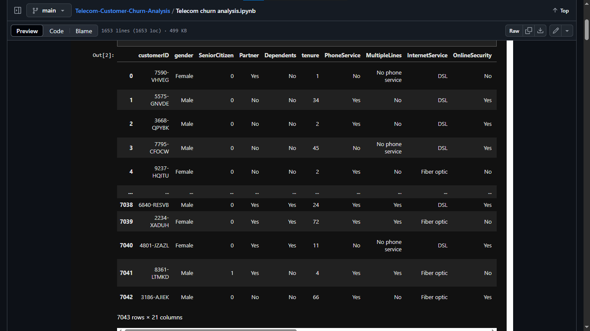

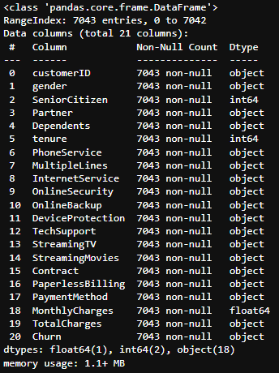

Then, I looked for empty values and found that there were no null values, which saved me from taking care of missing values.

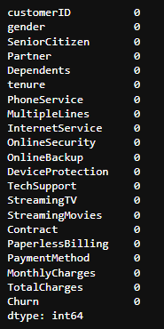

I noticed then the `TotalCharges` column had 'object' data-type values, I looked for starting rows of `TotalCharges` column and found entire column has filled with a blank value ` `, then I replaced the ` ` value with a string `"0"` value, and then changed it's data type to float by using `astype()` method.

Then, I looked for the number of null values over the entire DataFrame and found that there were no missing values, so I was good to proceed further.

Then, I tried to have a descriptive look at the DataFrame by using the `describe()` method on the DataFrame.

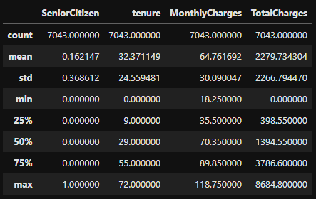

Had a look at duplicate values over an entire DataFrame, and there were no duplicate values. I specifically checked for duplicate values in the `customerID` column, since every customer will have a unique customer ID. If there have been any duplicacies in the `customerID`, then that entire row would have been a duplicate.

Column `SeniorCitizen` had values in integer, in the dataset, if they wanted to represent a customer as a senior citizen, they used `0` and `1` binary values for representing that, with `0` meaning they're not a senior citizen and `1` meaning the  customer is a senior citizen. This was resulting in confusion, and this would also create a problem while plotting the data, so I decided to change these binary `0` and `1` values to `No` and `Yes`, respectively. This change was done with the help of a function I made, `convert(value)`, which took each value in the column as a function parameter and then, by using the conditional change, converted the values to `Yes` and `No`.

Then, I started using Matplotlib and the Seaborn library for visualization purposes. First, let's look at the number of customers by churn using a bar chart, then let's have a look at what percentage of customers have churned, so get how many of our customers were unsatisfied with us.

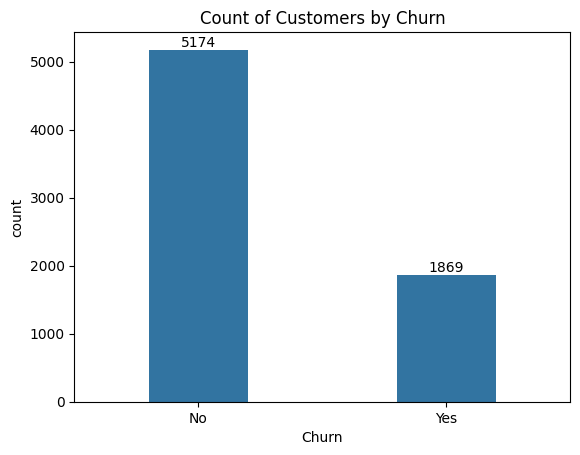
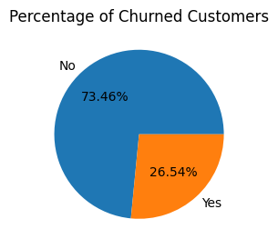

Then I tried to have a look at churn based on gender, looking at the analysis, I found that male customers and female customers equally have churned out, so there is no gender specific problem with our service that we weren't able to cater to.

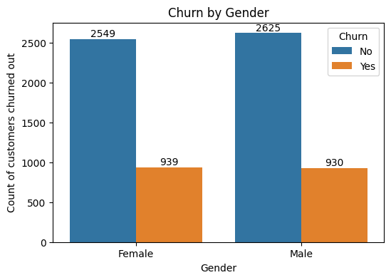

Then, I looked at churn based on senior citizens and non-senior citizens, found out that `476` out of `666` senior citizens churned out, which points that our services need attention so that we could retain our senior customers. This was done with the help of a bar plot.

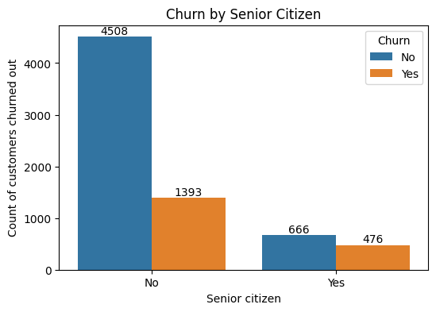

Then, I tried looking at churn by tenure of their services and found out that people who have used our services for a long time have stayed, and people who have used our services for 1 or 2 months have churned out the most.

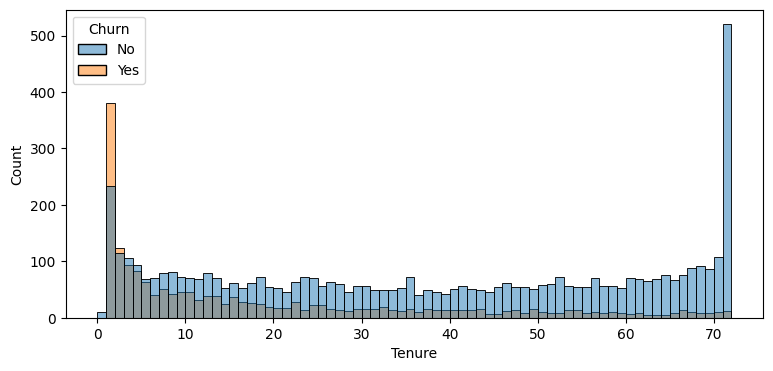

Have a look at the type of contract customers have; those with a month-to-month contract have the highest churn-out rate, while people with one-year or two-year contracts have a lower churn rate, the better retention. So, we need to focus on promoting longer contracts among our customers.

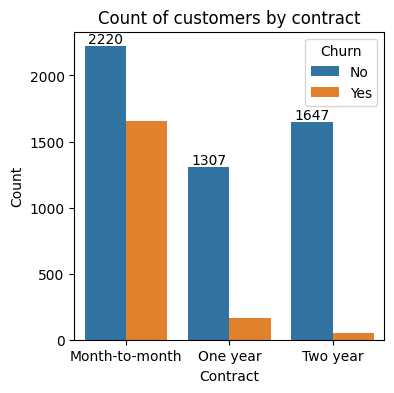

Let's have a look at customers who have subscribed to any kind other services such as streaming movies, streaming TV, multiple lines, internet services, online security, online backup, device protection, tech support, etc. Let's focus on people who've subscribed to our movie streaming service. People who've subscribed to movie streaming services are less likely to churn out, and people with no internet service at all are the least likely to churn out.

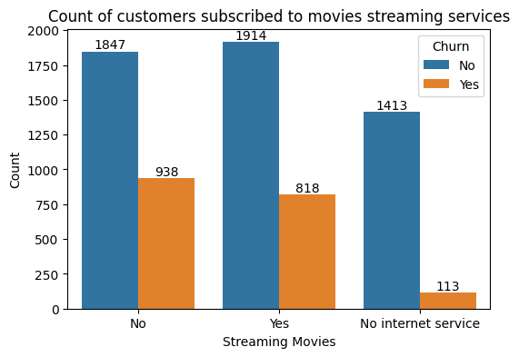

Other services data can be found in the following subplots.
### Summary of churn patterns by services
1. **Phone Services and Multiple Lines**
   - Most customers have a phone service
   - Churn is significantly lower among customers using phone services
   - Customers with multiple lines show a higher churn rate than those with no phone services or a single line
2. **Internet Service**
   - Fiber optic users show the highest churn rate then followed by DSL
   - Customers with no internet service have the lowest churn, likely because they use minimal services or are elderly
3. **Online Security, Online Backup, Device Protection, Tech Support**
   - Churn is higher among customers who don’t have these services
   - Customers with security, backup, or tech support are more loyal, with a lower churn rate
4. **Streaming TV & Streaming Movies**
   - Churn appears slightly higher among customers who do not use streaming services
   - However, the difference is not as significant as in technical support or security-related services

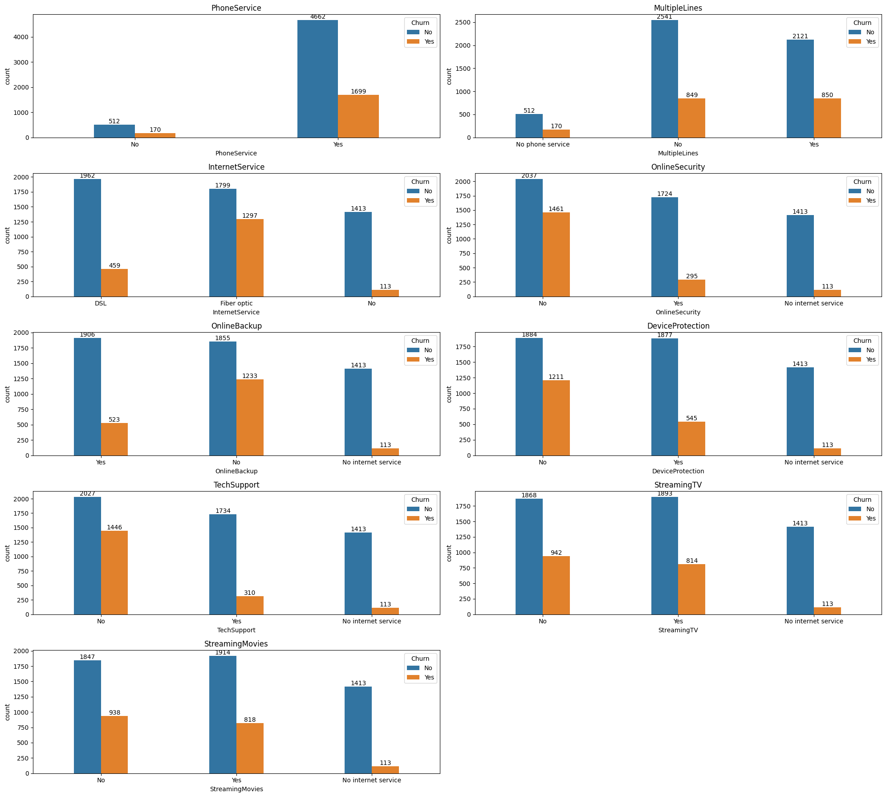

Let's have a look at the payment method used by the customer and what effect it has on the churn-out rate.

People using the automatic payment method had a lower churn-out rate, while people using electronic check and mailed check (both of them being non-automatic payment methods), this could be because once customer has setup automatic payment then they forgot to stop the service, even if they're not actively using it, services keep running because of automatic payments.

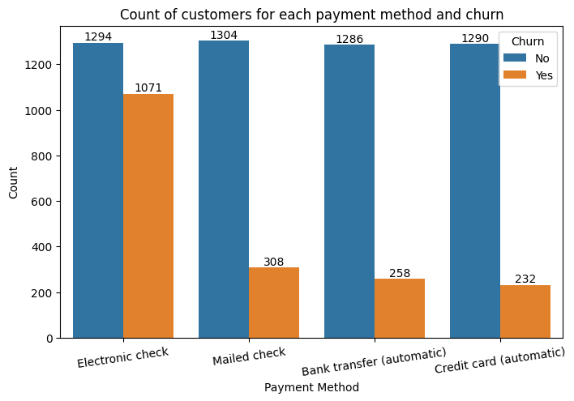
